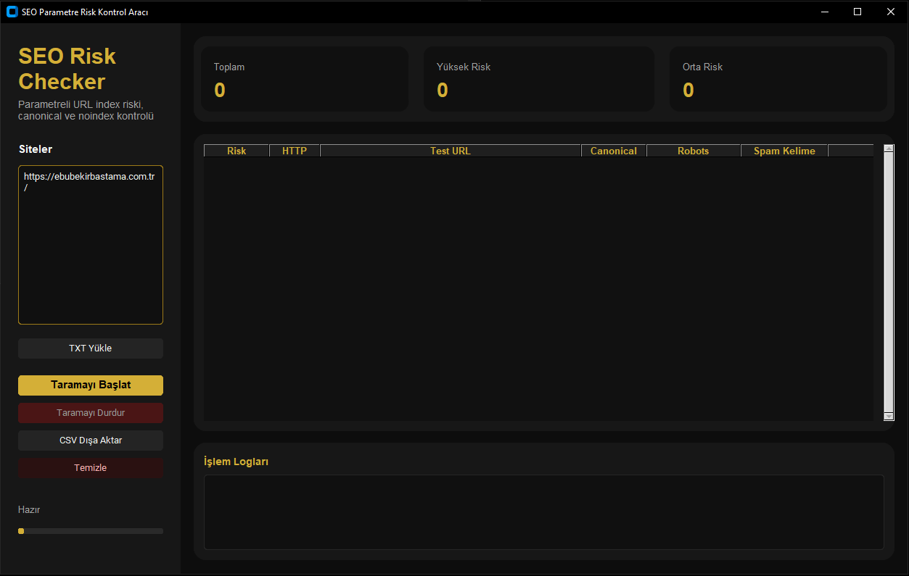
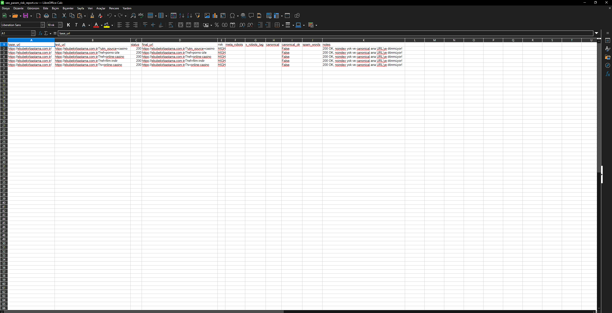

# SEO Param Risk Checker

<div align="center">

# SEO Param Risk Checker

Advanced Technical SEO & URL Parameter Security Scanner


Detect indexing risks, canonical issues, noindex problems and spam injections on parameterized URLs.

</div>

---

## Overview

SEO Param Risk Checker is a desktop application designed for Technical SEO professionals, agencies and webmasters.

The tool automatically analyzes parameterized URLs and identifies SEO risks that may lead to unwanted indexing, spam page creation, canonical conflicts, or search engine visibility issues.

---

## Key Features

| Feature                | Description                                            |
| ---------------------- | ------------------------------------------------------ |
| URL Parameter Testing  | Tests suspicious query parameters automatically        |
| Canonical Validation   | Checks whether canonical tags point to the correct URL |
| Meta Robots Analysis   | Detects indexing directives                            |
| X-Robots-Tag Analysis  | Reads server-side indexing rules                       |
| Spam Detection         | Finds casino, betting and adult content injections     |
| HTTP Status Validation | Analyzes response codes                                |
| Multi-Site Scanning    | Scan hundreds of websites                              |
| Parallel Processing    | Faster scanning using threads                          |
| CSV Reporting          | Export detailed reports                                |
| Dark Mode UI           | Modern desktop interface                               |

---

## Screenshots

### Main Interface


### Scan Results





### CSV Report Export





---

## How It Works

The scanner automatically appends predefined suspicious parameters to target URLs:

```text
?ref=online-casino
?ref=porno-izle
?ref=film-indir
?utm_source=casino
?s=online-casino
```

For each generated URL the application checks:

* HTTP Status Code
* Final Redirect URL
* Canonical Tag
* Meta Robots Tag
* X-Robots-Tag Header
* Spam Content
* Indexability Risk

---

## Risk Classification

### HIGH RISK

* HTTP 200 response
* No "noindex" directive
* Invalid canonical
* Spam content detected

Example:

```text
https://example.com/?ref=online-casino
```

Could potentially be indexed by Google.

---

### MEDIUM RISK

* No noindex found
* Canonical points correctly

May still require manual review.

---

### LOW RISK

* noindex exists
* 404 / 410 response
* Properly blocked parameter pages

---

### ERROR

* Timeout
* SSL error
* Connection failure
* HTML parsing issue

---

## Installation

Clone the repository:

```bash
git clone https://github.com/ebubekirbastama/seo-param-risk-checker.git
cd seo-param-risk-checker
```

Install dependencies:

```bash
pip install -r requirements.txt
```

Run:

```bash
python seo_gui_checker.py
```

---

## Requirements

```txt
customtkinter
requests
beautifulsoup4
pandas
```

---

## Project Structure

```text
seo-param-risk-checker
│
├── seo_gui_checker.py
├── requirements.txt
├── LICENSE
├── README.md
│
├── screenshots/
│   ├── main-screen.png
│   ├── scan-results.png
│   └── report-export.png
│
└── reports/
```

---

## Use Cases

### SEO Agencies

Audit client websites for parameter indexing vulnerabilities.

### Technical SEO Specialists

Verify canonical and robots implementations.

### Website Owners

Detect spam page generation before search engines index them.

### Security Researchers

Analyze URL parameter abuse and spam injection vectors.

---

## Export Reports

The application generates:

* CSV Reports
* Automated Scan Logs
* Risk Summaries

Example output:

```csv
risk,status,url,canonical_ok,spam_words
HIGH,200,https://site.com/?ref=casino,false,casino
LOW,404,https://site.com/?ref=casino,false,
```

---

## Roadmap

* [ ] Sitemap analysis
* [ ] robots.txt validation
* [ ] Google Search Console integration
* [ ] Bulk CSV import
* [ ] PDF reporting
* [ ] Scheduled monitoring
* [ ] SEO vulnerability scoring

---

## Contributing

Contributions, issues and feature requests are welcome.

Feel free to fork the repository and submit pull requests.

---

## License

Copyright © 2026 Ebubekir Baştama

Licensed under the Apache License, Version 2.0.

http://www.apache.org/licenses/LICENSE-2.0

---

## Author

Ebubekir Baştama

GitHub:
https://github.com/ebubekirbastama

Project:
https://github.com/ebubekirbastama/seo-param-risk-checker
